## Overview

This picks up where the [10x → GeneExt → CellBender pipeline](scrnaseq-10x-geneext-cellbender.qmd) stops. It is two R Markdown files, run in order, interactively in RStudio (chunk by chunk, not knitted start to finish):

| Step | Template | Input → output |
|---|---|---|
| 1. QC | `scrnaseq_1_QC.Rmd` | CellBender `*_filtered.h5` per sample → `QC_Files/SeuratObjectFiltered_<SPECIES>_<sample>.rds` + QC summary table |
| 2. Cluster calling | `scrnaseq_2_ClusterCalling.Rmd` | Filtered `.rds` files → `<SPECIES>_integrated.rds` with final clusters + diagnostics |

```{mermaid}
flowchart LR
  H[CellBender .h5<br/>per sample] --> T[Threshold filter<br/>nFeature / nCount]
  T --> D[scDblFinder<br/>on filtered cells]
  D --> S[SCTransform<br/>per sample]
  S --> I[Integrate<br/>anchors]
  I --> P{{PCs}}
  P --> U{{UMAP<br/>settings}}
  U --> R{{Resolution}}
  R --> O[(Integrated object<br/>+ cluster QC)]
```

The hexagons are **decision points**. The template saves the diagnostics, then stops until you set the value yourself after looking at them. Nothing is picked automatically.

## Inputs

- One CellBender `*_cellbender_output_filtered.h5` per sample (empty droplets and ambient RNA already removed, so there is no separate `emptyDrops()` step).
- A table of sample IDs plus one **covariate** per sample (genotype, treatment or batch). It is carried through so you can check that clusters aren't driven by a single sample.

## Software

R ≥ 4.3 with:

```r
install.packages(c("tidyverse", "here", "Seurat", "scCustomize", "conflicted", "clustree",
                   "cluster", "clusterCrit", "FNN", "patchwork", "ggrastr"))
BiocManager::install(c("scDblFinder", "SingleCellExperiment", "glmGamPoi"))
```

Step 2 is the memory-hungry part (SCTransform + anchor integration). If it runs out of memory locally, run it on the cluster.

## Run it {#run-it}

1. **Download both templates** into your project (an RStudio project, so `here()` finds the root):

   [Download `scrnaseq_1_QC.Rmd`](scripts/scrnaseq_1_QC.Rmd){.btn .btn-sm .btn-outline-primary download="scrnaseq_1_QC.Rmd"} [Download `scrnaseq_2_ClusterCalling.Rmd`](scripts/scrnaseq_2_ClusterCalling.Rmd){.btn .btn-sm .btn-outline-primary download="scrnaseq_2_ClusterCalling.Rmd"}

2. **Fill in the Configuration chunk** of step 1. Replace every `<fill in: ...>` value; the next chunk stops if any are left:

   ```r
   SPECIES        <- "<fill in: species code, e.g. Gfas>"
   cellbender_dir <- here("<fill in: folder with CellBender .h5 files>")
   qc_out_dir     <- here("<fill in: output folder, e.g. output/Gfas/QC>")
   sample_config  <- tribble(
     ~sample_id,               ~covariate,                    ~file,
     "<fill in: sample ID 1>", "<fill in: e.g. genotype 1>",  "<fill in: sample1_..._filtered.h5>",
     ...
   )
   ```

   Also set `fix_feature_ids()` (if your gene IDs need reformatting) and `MITO_GENES` (a pattern or list of mitochondrial gene IDs as they appear in the matrix; leave `NULL` if your reference has none). The template prints the mito genes it found and stops if it found none. `SYMBIONT_GENES` works the same way but only tracks the percentage (e.g. Symbiodiniaceae reads), it doesn't filter.

3. **Run the pre-filter plots, then set thresholds.** Look at `QC_Plots_<sample>.jpeg` before trusting the default `qcMetricsThresholds`; the defaults are the values used for *G. fascicularis* (and *P. damicornis*).

4. **Run the filter chunk** and check `QC_Filtered_Summary_<SPECIES>.csv` (see [checks](#checks)).

5. **Step 2:** fill in its Configuration chunk (same `SPECIES` and sample IDs), then run chunk by chunk, setting each decision value when you reach it.

## What each step does

### Step 1: QC

1. **Load** each CellBender `.h5` (`scCustomize::Read_CellBender_h5_Mat`), optionally reformat feature IDs, and add `sample_id`, `covariate` and the complexity score `log10GenesPerUMI`.
2. **Pre-filter plots**: violins of nFeature, nCount, log10GenesPerUMI (and percent_mito if available) with the thresholds drawn on.
3. **Threshold filter** on nFeature and nCount (and percent_mito).
4. **Doublets**: `scDblFinder` on the cells that *passed* the filter (see [known issues](#known-issues) for why the order matters), then keep singlets.
5. **Save** one `.rds` per sample and a summary table.

### Step 2: cluster calling

1. **SCTransform** each sample (`glmGamPoi`). percent_mito is *not* regressed out unless you set `REGRESS_MITO <- TRUE`; filtering high-mito cells in step 1 is the default. It also reports how many variable features the samples share.
2. **Integrate** with `SelectIntegrationFeatures` → `PrepSCTIntegration` → `FindIntegrationAnchors` → `IntegrateData` (3,000 features; automatic retry at 2,000 if it runs out of memory).
3. **PCs (decision 1)**: elbow plot, cumulative variance table, and PC gene-loading heatmaps in blocks of 9. Set `DIMS_FINAL`.
4. **UMAP settings (decision 2)**: a grid of `n.neighbors` × `min.dist` with neighborhood preservation, Calinski–Harabasz, Davies–Bouldin, silhouette and covariate-mixing entropy. Set `NN_FINAL` and `MDIST_FINAL`.
5. **Resolution (decision 3)**: clusters at resolutions 0.2–1.0, with cluster count vs. resolution, clustree, silhouette vs. resolution, and one UMAP per resolution. Set `RES_FINAL`.
6. **Cluster QC**: cells per cluster, % from the largest covariate level (flags < 50 cells or > 90% one level), QC violins per cluster, covariate stacked bar, and a UMAP split by covariate.
7. **Save** `<SPECIES>_integrated.rds` and `00_Finalised_Parameters.csv` (the values you chose, for the record).

## Checks before moving on {#checks}

- **Doublet rate** roughly 0.5–10% for 10x data. Much higher usually means scDblFinder got unfiltered droplets, not that the data are bad.
- **Doublet score histogram**: ideally the singlet/doublet cut sits in a trough. In low-UMI coral data there is often no clear second peak, and the cut falls in the right tail; that's acceptable if the rate is reasonable, but don't over-interpret individual calls.
- **percent_mito actually varies** (if you set `MITO_GENES`). A column of zeros means the pattern matched nothing; see [known issues](#known-issues).
- **Clusters flagged > 90% one sample**: could be real biology (a genotype-specific state) or a batch effect. Look at their markers before naming them.
- Write down *why* you chose each decision value in your notebook entry. `00_Finalised_Parameters.csv` only records *what* was chosen.

## Example: *Galaxea fascicularis* whole atlas

Three control colonies, each a different genotype and its own 10x lane (19876-001, 22901-001, 23362-001), August–September 2026. The CellBender reference combined the Galaxea nuclear genome, the published Galaxea mitogenome (Lu et al. 2024, GenBank ON341021) and *Symbiodinium microadriaticum*, so this dataset has real mitochondrial reads and symbiont reads to track.

### QC

| Sample | Droplets in | After thresholds + mito | Doublets removed | Cells kept | Median genes | Median UMIs | Median % mito |
|---|---|---|---|---|---|---|---|
| 19876-001 | 27,481 | 9,202 | 915 (9.9%) | 8,287 | 509 | 741 | 3.4 |
| 22901-001 | 15,201 | 2,878 | 160 (5.6%) | 2,718 | 541 | 805 | 3.8 |
| 23362-001 | 14,701 | 3,914 | 256 (6.5%) | 3,658 | 503 | 752 | 2.0 |
| **Total** | 57,383 | | | **14,663** | | | |

- **Thresholds:** 300–6,000 genes, 400–35,000 UMIs and ≤ 10% mito reads per cell. The gene and UMI bounds are the template defaults. The mito cap removed a further 0.3–7.5% of cells per sample on top of them.
- **Mito genes:** the mitogenome genes ended up with anonymous `gene_N` IDs in the reference, so the 5 mito genes were identified from the data. They are highly expressed, detected in 33–89% of cells, tightly co-expressed with each other (r = 0.52–0.93) and consistent across samples. See [Known issues](#known-issues).
- **Symbiont reads** (`percent_smic`) were tracked but not used to filter: 0.2–0.4% of library UMIs per sample.
- **Doublets:** scDblFinder on the filtered cells, per sample, called 5.6–9.9%.
- **Complexity:** median log10GenesPerUMI 0.95 in all three samples.

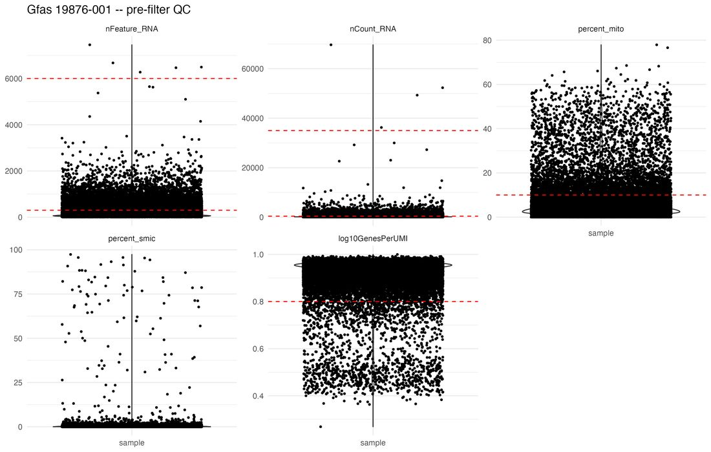

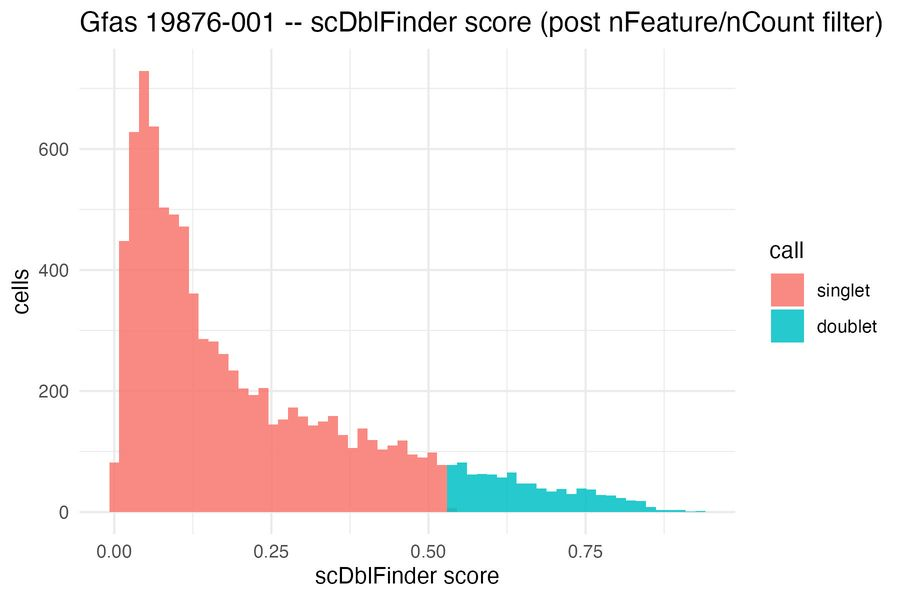{width=65%}

### Cluster calling

**14,663 cells**, integrated at 3,000 features. Shared variable features between sample pairs: Jaccard 0.43–0.50. The PC count was compared at 25 and 30, with the UMAP sweep run at both before one was chosen.

| Decision | Chosen | Why |
|---|---|---|
| PCs | **25** | No sharp elbow (steep drop through PC8, then a long taper). PC25 sits on the 85% cumulative-variance line (85.5%); PC30 (89.8%) was the first choice and was kept as a comparison. PC heatmaps showed nothing important lost by trimming to 25 |
| UMAP | **n.neighbors 50, min.dist 0.3** | Neighborhood preservation was within 0.006 across the top settings (0.49–0.50). n.neighbors 50 gave the cleanest, best-separated layout in the 3 × 3 grid, while 20 looked fragmented |
| Resolution | **0.4 → 20 clusters** | Silhouette peaks at 0.4 (0.354; 0.348 at 0.3, 0.304 at 0.5). Clustree shows 0.3 → 0.4 as mostly clean 1:1 refinements, while 0.4 → 0.5 brings several multi-way splits. The cluster count rises steadily (18 at 0.2 → 32 at 1.0) with no plateau |

::: {layout-ncol=2}
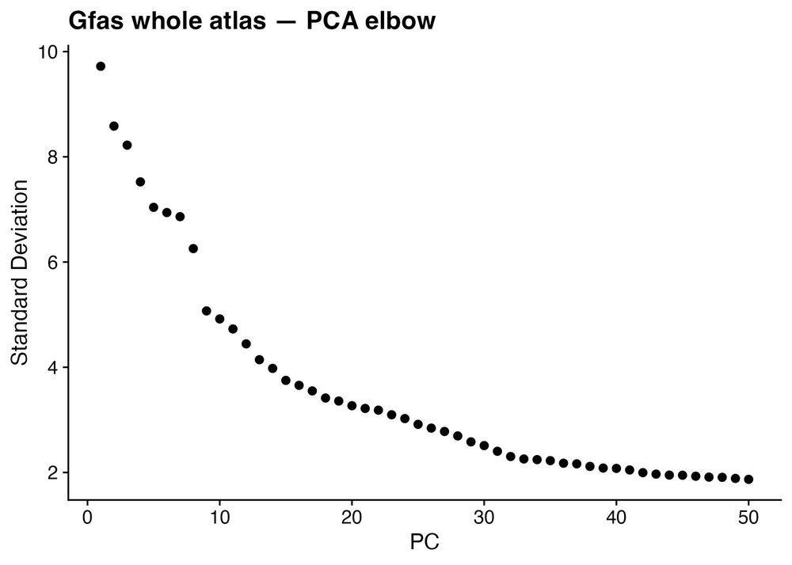

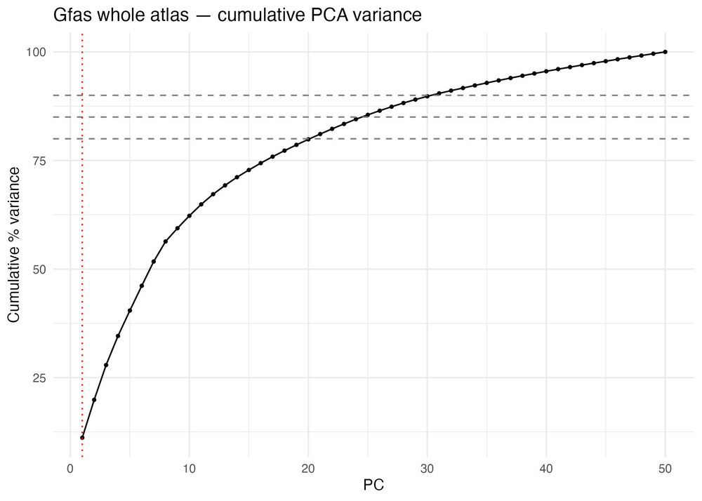
:::

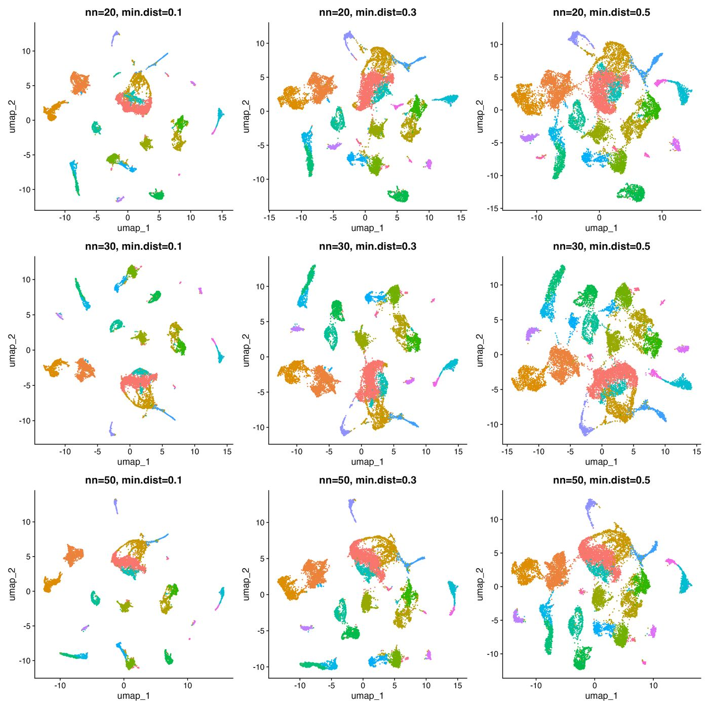{width=85%}

::: {layout-ncol=2}
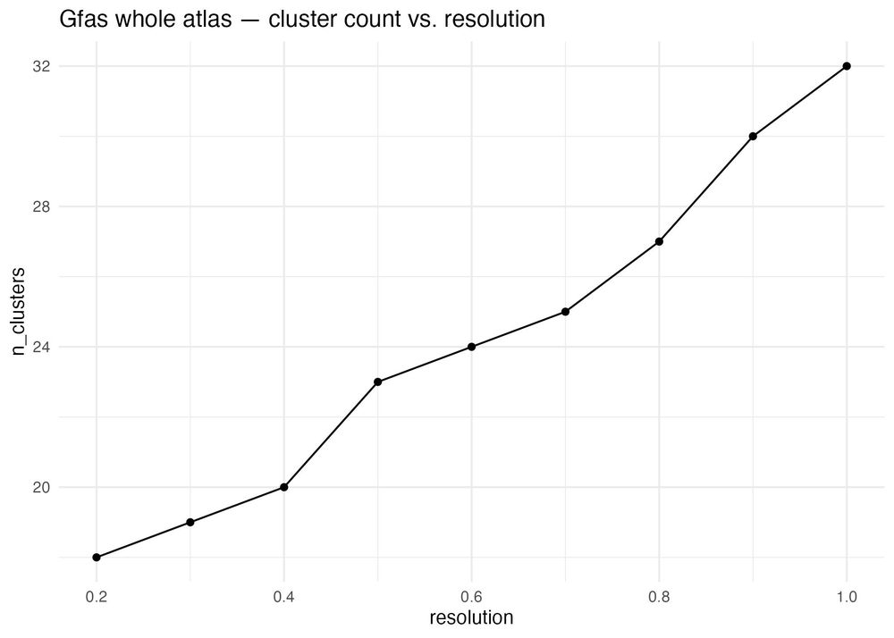

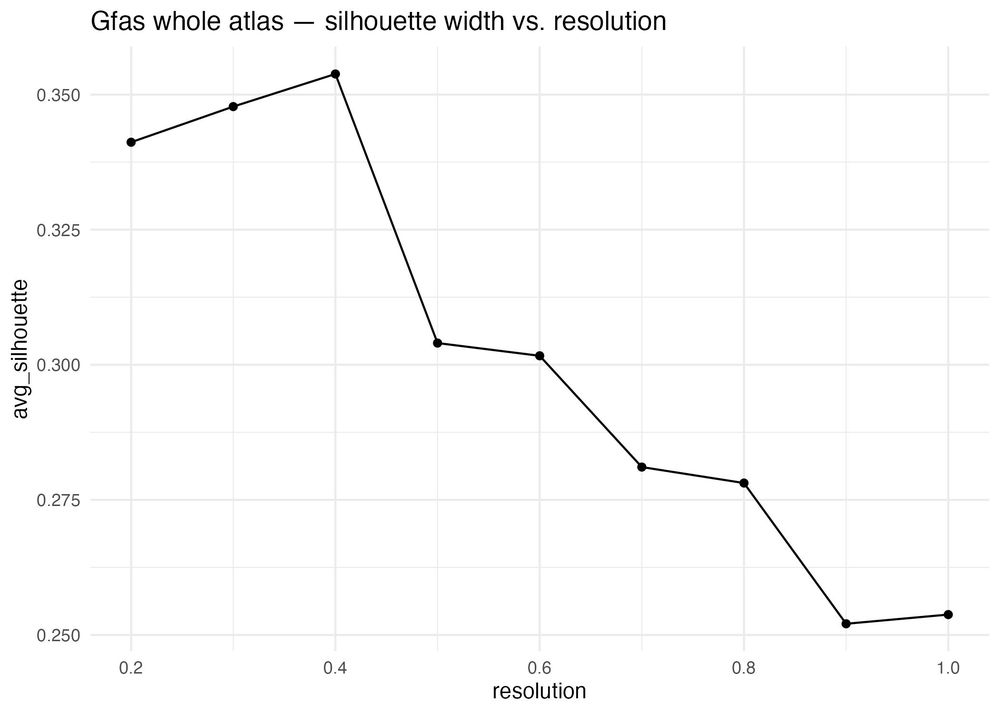
:::

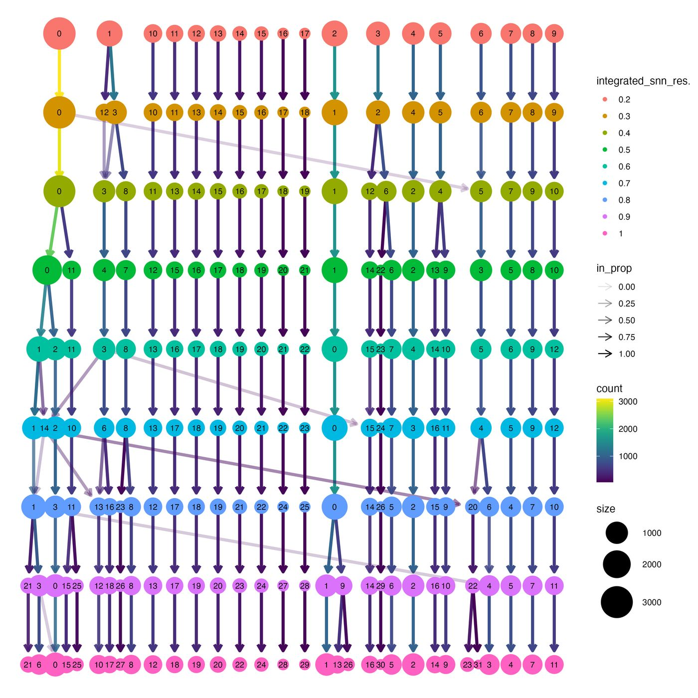{width=80%}

::: {layout-ncol=2}
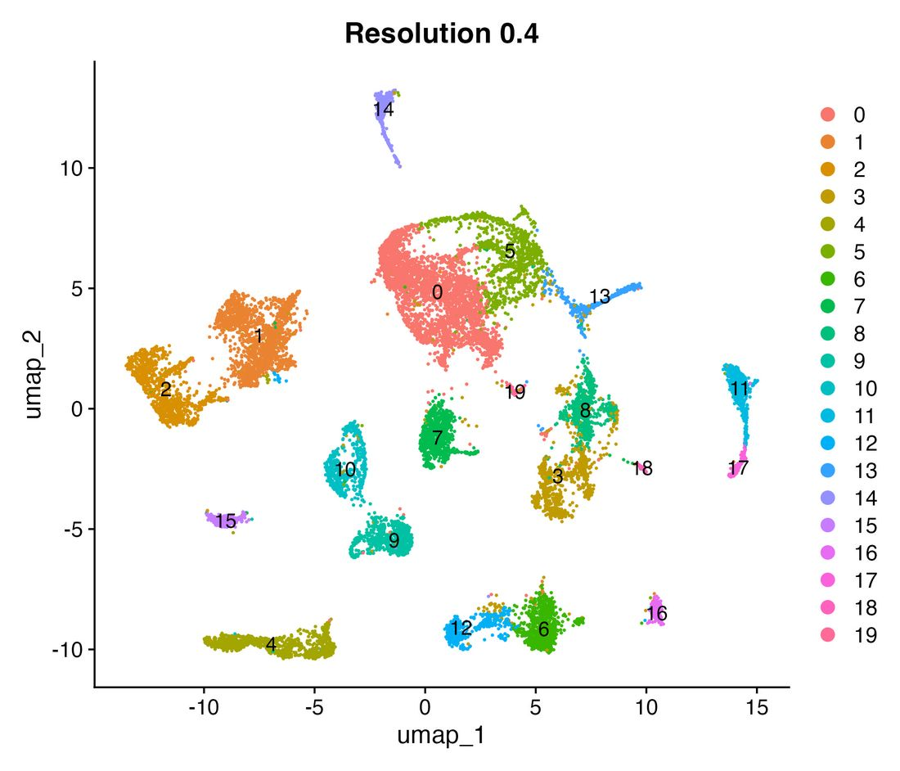

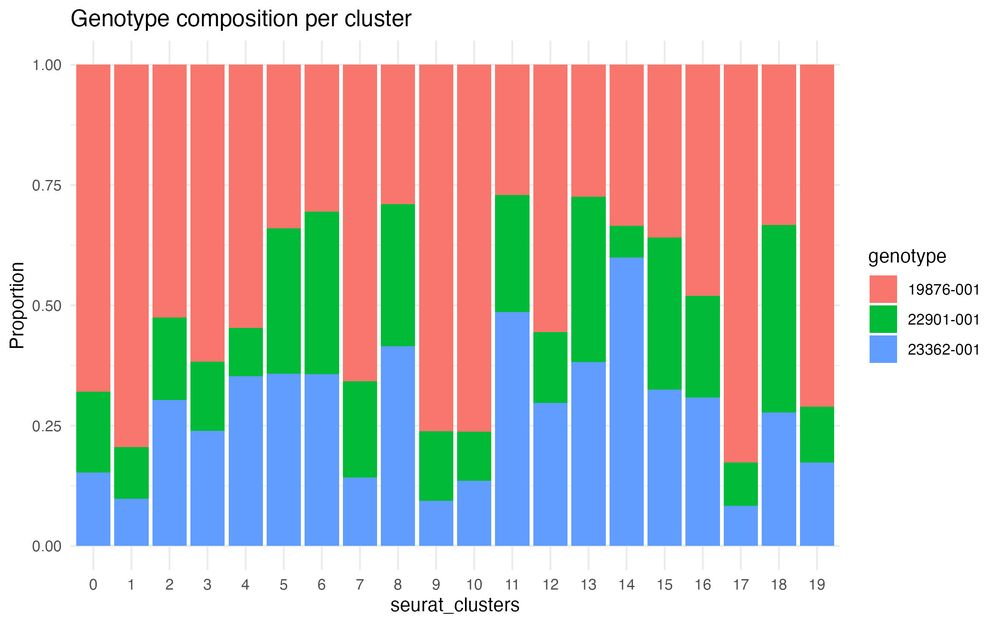
:::

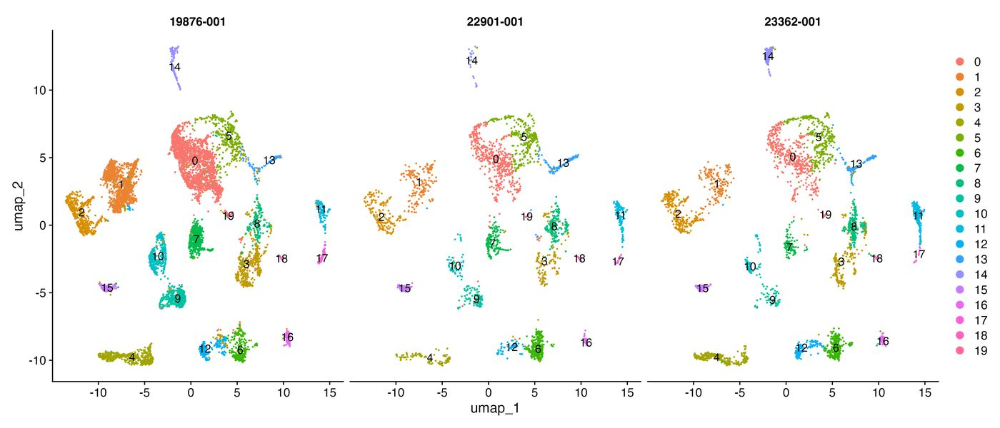

**Cluster QC.** No cluster was flagged: the smallest (cluster 19) has 69 cells, and the most genotype-skewed (cluster 17) is 82.7% one genotype. Clusters 0 and 1 carry higher mito (median ~4–5% vs ~2–3% elsewhere). Clusters 10 and 19 have long nCount tails (up to ~22,000 and ~18,000 UMIs), so they're worth checking for doublets or stressed cells during annotation.

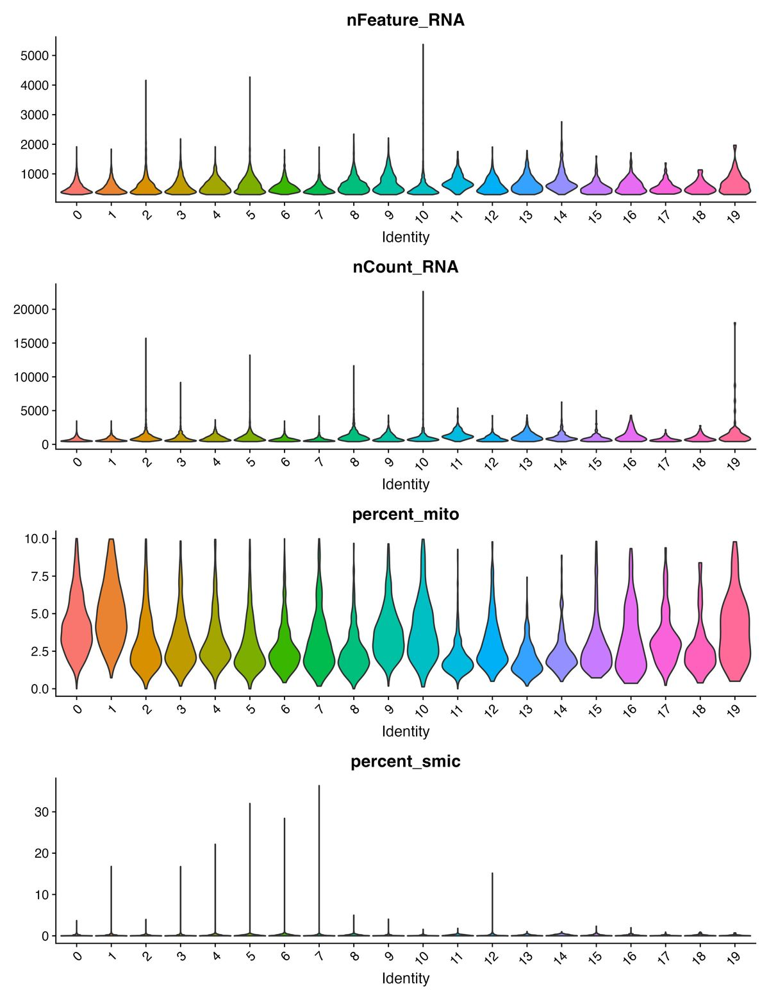{width=80%}

::: {.callout-note}
## One library per genotype
Each genotype is a single 10x lane, so genotype and batch are confounded. A genotype-skewed cluster is a hypothesis to check against marker genes, not evidence of a genotype effect.
:::

## Known issues {#known-issues}

::: {.callout-warning collapse="false"}
## Run scDblFinder after filtering, not on the raw CellBender output
scDblFinder's expected doublet rate grows with the number of cells it is given (~1% per 1,000 cells). On the unfiltered CellBender output (which still contains many marginal droplets) it called 20–39% of Pdam cells doublets. Run on the threshold-filtered cells it called a realistic 6.5–11%.
:::

::: {.callout-warning collapse="false"}
## Check that your mitochondrial genes are actually counted
In the first Galaxea QC run, `percent_mito` was **0 in every cell**, so the mito filter silently did nothing, and the symbiont counts were all zero too. The mito gene IDs had been written with underscores (`gene_36687`), but Seurat converts underscores to dashes on load (`gene-36687`), so the list matched no features. The same thing happened earlier with a pattern-based mito definition in an older Galaxea analysis.

Two fixes are now built into the step 1 template:

- write `MITO_GENES` in the form the IDs take *in the Seurat object* (after `fix_feature_ids()` and Seurat's own `_` → `-` conversion);
- the template prints the mito genes it found and **stops if it found none**.

A flat zero `percent_mito` violin is the giveaway.

If the mitogenome genes have uninformative IDs (Galaxea's became `gene_N` when the references were combined), look for a small set of highly expressed, near-universally detected, tightly co-expressed features. Animal mitochondrial genes are transcribed together, so they correlate strongly. For Galaxea, 5 genes stood out, with a sharp drop in correlation after them (next best r = 0.27). 10x 3′ chemistry captures only some of the ~15 mitochondrial transcripts, so finding just a few is expected.

If your reference has no mito genes (e.g. *P. damicornis*), leave `MITO_GENES <- NULL`. `log10GenesPerUMI` is plotted as a mito-independent check for damaged or low-complexity droplets (reference line at 0.80, not used as a filter).
:::

::: {.callout-note collapse="true"}
## Gene IDs: underscores vs dashes
Seurat swaps `_` for `-` in feature names and warns about it, so IDs like `pdam_00025168` from GeneExt/CellBender become `pdam-00025168`. Pdam IDs are converted once at load time with `fix_feature_ids()` so the IDs match your [functional annotation](functional-annotation.qmd) and [ortholog](orthofinder-multispecies.qmd) tables.
:::

::: {.callout-note collapse="true"}
## `FindIntegrationAnchors` runs out of memory
With Seurat v5 and 3,000 features this can fail with a memory error. The template retries at 2,000 features and records the number actually used in `00_Finalised_Parameters.csv`.
:::

::: {.callout-note collapse="true"}
## The UMAP sweep doesn't change the clusters
`n.neighbors` and `min.dist` only change the 2D picture; clusters come from the PCA neighbor graph. So in the Galaxea sweep, silhouette, Calinski–Harabasz, Davies–Bouldin and entropy were identical for every UMAP setting, and only neighborhood preservation varies. Treat this as a visualization choice.
:::

::: {.callout-note collapse="true"}
## Low silhouette widths are normal here
Average silhouettes of 0.25–0.35 (Galaxea) look low but are typical for integrated scRNA-seq with many related cell states. Use it to compare resolutions (look for a peak or plateau), not as an absolute quality score.
:::

## How it connects

- **Before:** [10x Cell Ranger → GeneExt → CellBender](scrnaseq-10x-geneext-cellbender.qmd) produces the `.h5` inputs.
- **After:** clusters are annotated using [functional annotation](functional-annotation.qmd) of each gene, and markers transferred from other species through [OrthoFinder orthologs](orthofinder-multispecies.qmd).

## Full templates

::: {.panel-tabset}
## Step 1: QC

````{.r filename="scrnaseq_1_QC.Rmd"}

````

## Step 2: Cluster calling

````{.r filename="scrnaseq_2_ClusterCalling.Rmd"}

````
:::

## References

- Hao Y et al. 2024. Dictionary learning for integrative, multimodal and scalable single-cell analysis (Seurat v5). *Nature Biotechnology* 42:293–304.
- Germain P-L et al. 2021. Doublet identification in single-cell sequencing data using scDblFinder. *F1000Research* 10:979.
- Hafemeister C & Satija R 2019. Normalization and variance stabilization of single-cell RNA-seq data using regularized negative binomial regression. *Genome Biology* 20:296.
- Zappia L & Oshlack A 2018. Clustering trees: a visualization for evaluating clusterings at multiple resolutions. *GigaScience* 7:giy083.
- Fleming SJ et al. 2023. Unsupervised removal of systematic background noise from droplet-based single-cell experiments using CellBender. *Nature Methods* 20:1323–1335.

## Changelog

| Date | Change |
|---|---|
| 2026-10-06 | Galaxea whole atlas (3 genotypes) used as the worked example for QC and cluster calling; mito-gene check; optional mito regression and symbiont tracking |
| 2026-10-05 | Generic templates (config chunk, covariate column, optional mito) and this page |
| 2026-08-27 | *P. damicornis* whole atlas: decision-point workflow, cluster QC flags |
| 2026-06 | *G. fascicularis* 6-sample integrated atlas (genotype × treatment), checked against the control-only atlas |
| 2026-08 | scDblFinder moved after threshold filtering |
