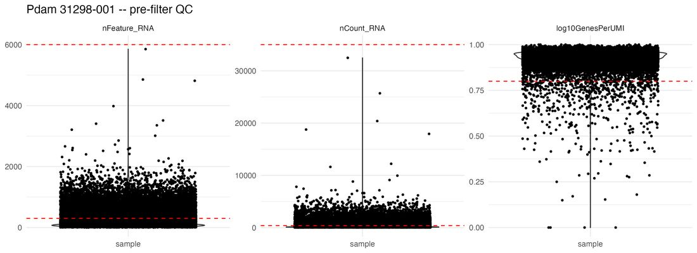
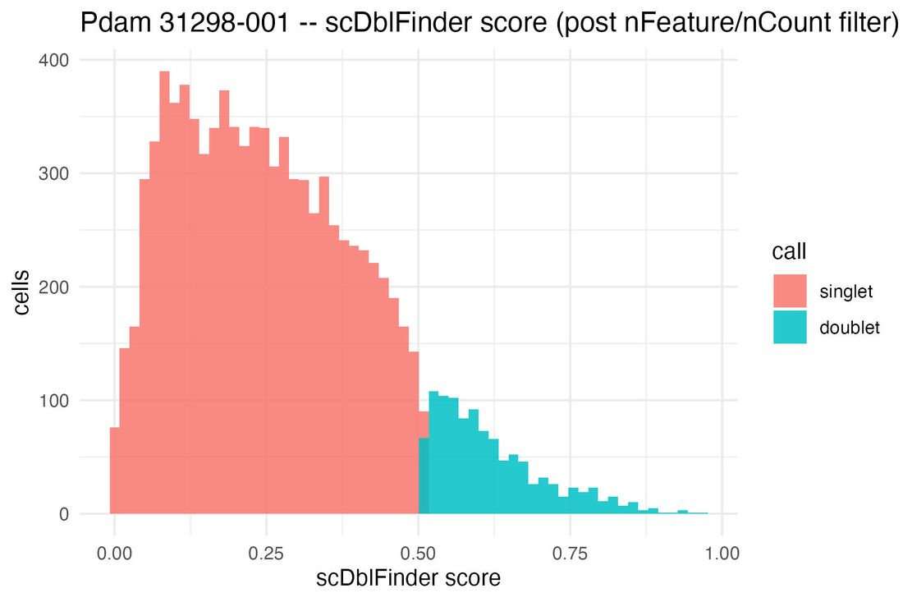
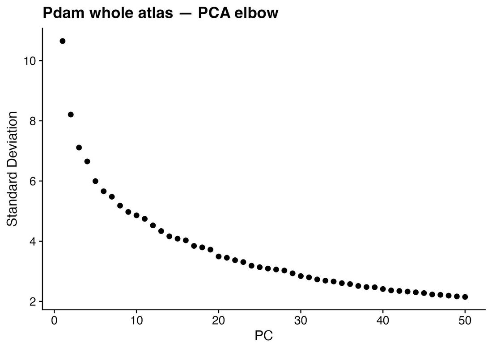
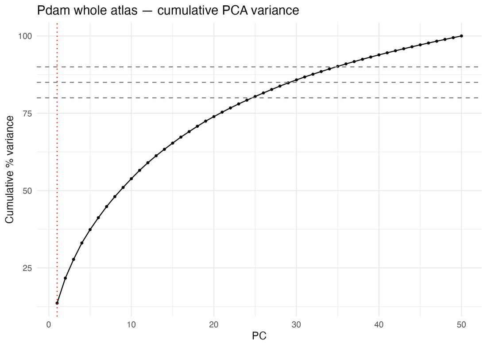
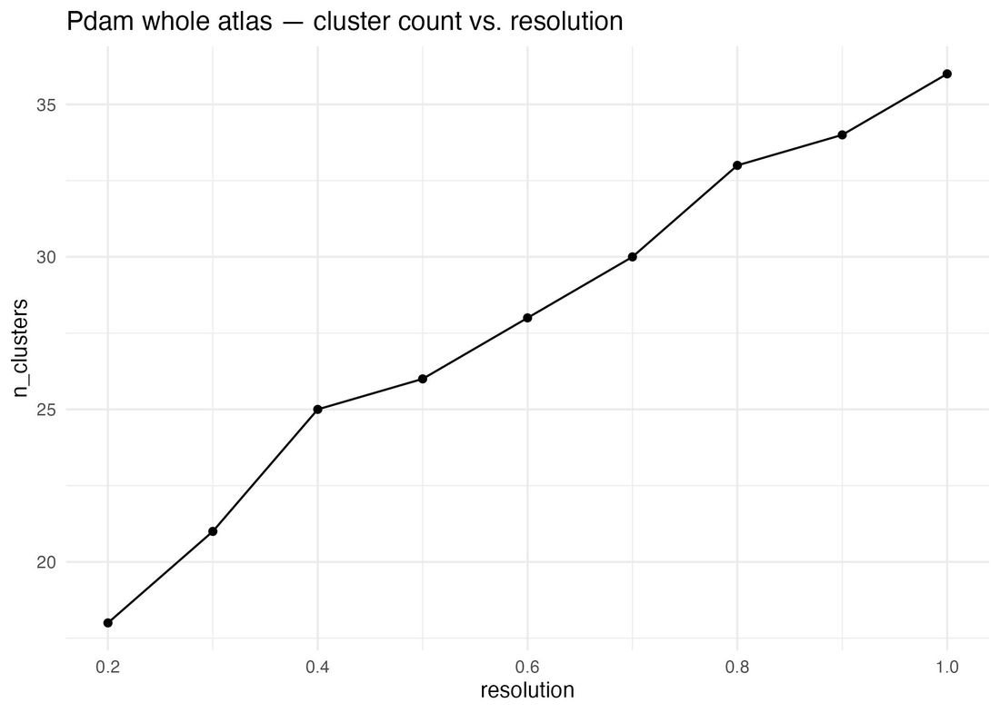
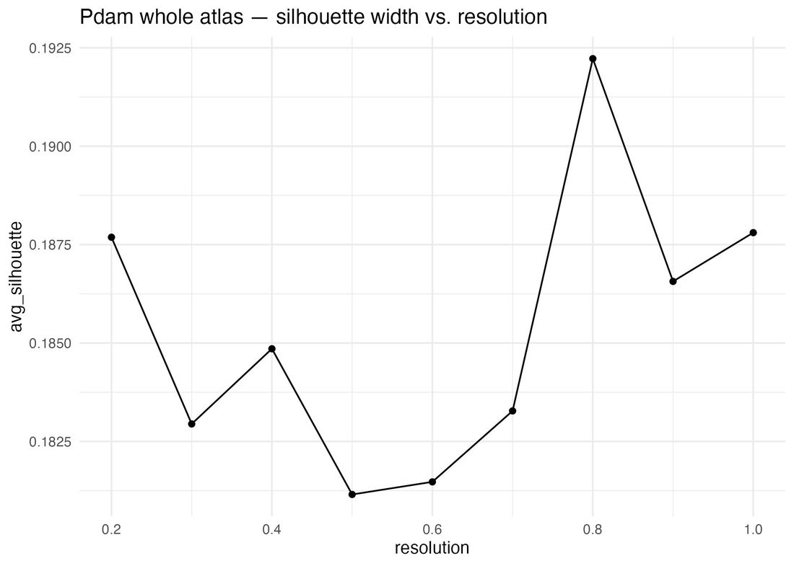
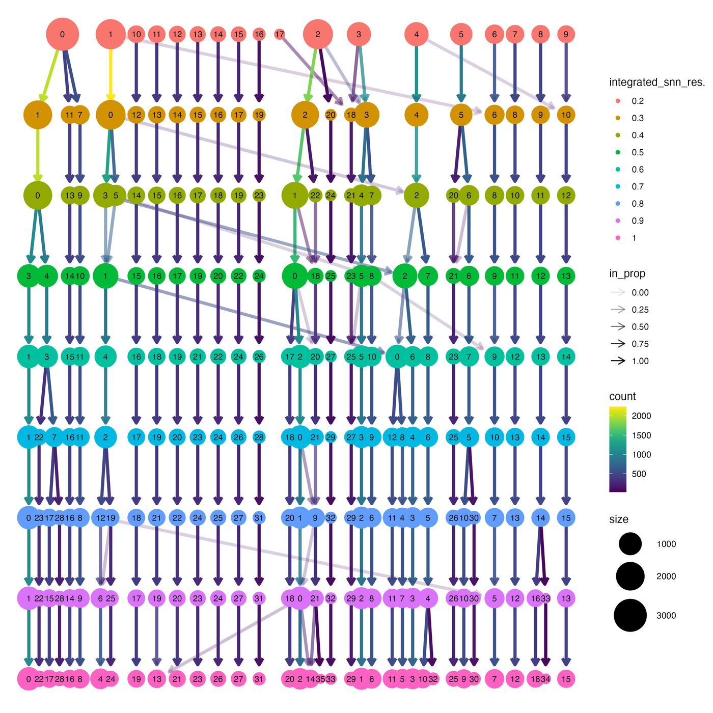
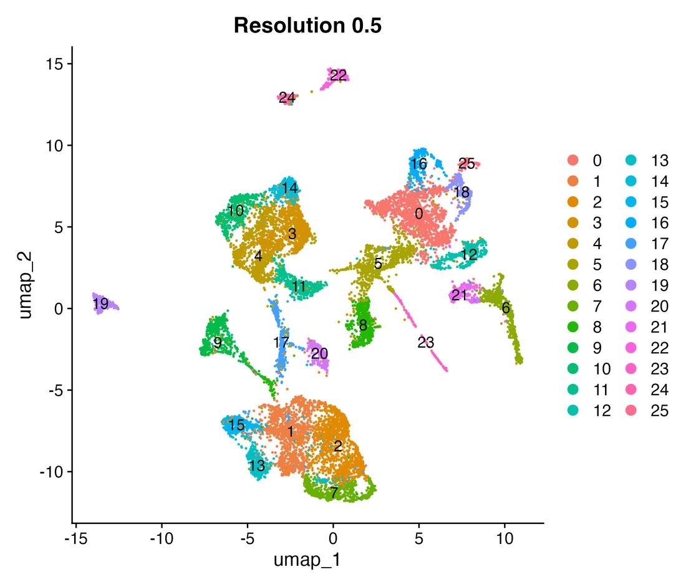
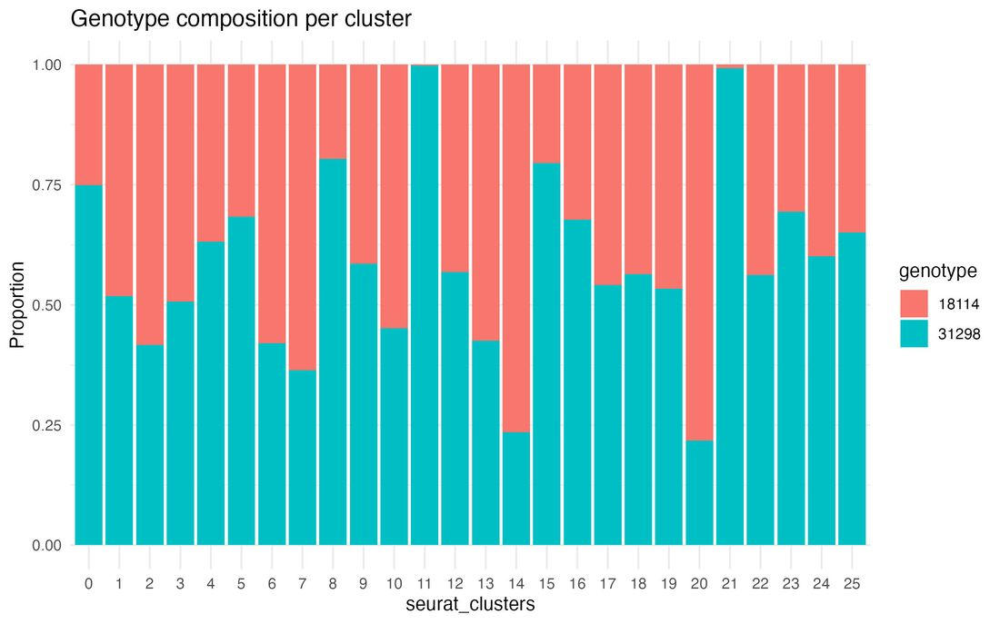
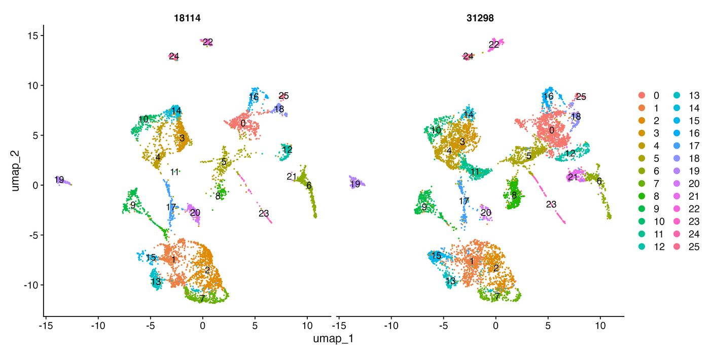

## Overview

This picks up where the [10x → GeneExt → CellBender pipeline](scrnaseq-10x-geneext-cellbender.qmd) stops. It is two R Markdown files, run in order, interactively in RStudio (chunk by chunk, not knitted start to finish):

| Step | Template | Input → output |
|---|---|---|
| 1. QC | `scrnaseq_1_QC.Rmd` | CellBender `*_filtered.h5` per sample → `QC_Files/SeuratObjectFiltered_<SPECIES>_<sample>.rds` + QC summary table |
| 2. Cluster calling | `scrnaseq_2_ClusterCalling.Rmd` | Filtered `.rds` files → `<SPECIES>_integrated.rds` with final clusters + diagnostics |

```{mermaid}
flowchart LR
  H[CellBender .h5<br/>per sample] --> T[Threshold filter<br/>nFeature / nCount]
  T --> D[scDblFinder<br/>on filtered cells]
  D --> S[SCTransform<br/>per sample]
  S --> I[Integrate<br/>anchors]
  I --> P{{PCs}}
  P --> U{{UMAP<br/>settings}}
  U --> R{{Resolution}}
  R --> O[(Integrated object<br/>+ cluster QC)]
```

The hexagons are **decision points**. The template saves the diagnostics, then stops until you set the value yourself after looking at them. Nothing is picked automatically.

## Inputs

- One CellBender `*_cellbender_output_filtered.h5` per sample (empty droplets and ambient RNA already removed, so there is no separate `emptyDrops()` step).
- A table of sample IDs plus one **covariate** per sample (genotype, treatment or batch). It is carried through so you can check that clusters aren't driven by a single sample.

## Software

R ≥ 4.3 with:

```r
install.packages(c("tidyverse", "here", "Seurat", "scCustomize", "conflicted", "clustree",
                   "cluster", "clusterCrit", "FNN", "patchwork", "ggrastr"))
BiocManager::install(c("scDblFinder", "SingleCellExperiment", "glmGamPoi"))
```

Integration of two ~10k-cell samples ran fine on a laptop with 32 GB RAM. With more or larger samples, run step 2 on the cluster.

## Run it {#run-it}

1. **Download both templates** into your project (an RStudio project, so `here()` finds the root):

   [Download `scrnaseq_1_QC.Rmd`](scripts/scrnaseq_1_QC.Rmd){.btn .btn-sm .btn-outline-primary download="scrnaseq_1_QC.Rmd"} [Download `scrnaseq_2_ClusterCalling.Rmd`](scripts/scrnaseq_2_ClusterCalling.Rmd){.btn .btn-sm .btn-outline-primary download="scrnaseq_2_ClusterCalling.Rmd"}

2. **Fill in the Configuration chunk** of step 1. Replace every `<fill in: ...>` value; the next chunk stops if any are left:

   ```r
   SPECIES        <- "<fill in: species code, e.g. Pdam>"
   cellbender_dir <- here("<fill in: folder with CellBender .h5 files>")
   qc_out_dir     <- here("<fill in: output folder, e.g. output/Pdam/QC>")
   sample_config  <- tribble(
     ~sample_id,               ~covariate,                    ~file,
     "<fill in: sample ID 1>", "<fill in: e.g. genotype 1>",  "<fill in: sample1_..._filtered.h5>",
     ...
   )
   ```

   Also set `fix_feature_ids()` (if your gene IDs need reformatting) and `MITO_GENES` (leave `NULL` if your reference has no mitochondrial genes).

3. **Run the pre-filter plots, then set thresholds.** Look at `QC_Plots_<sample>.jpeg` before trusting the default `qcMetricsThresholds`; the defaults are the *P. damicornis* values.

4. **Run the filter chunk** and check `QC_Filtered_Summary_<SPECIES>.csv` (see [checks](#checks)).

5. **Step 2:** fill in its Configuration chunk (same `SPECIES` and sample IDs), then run chunk by chunk, setting each decision value when you reach it.

## What each step does

### Step 1: QC

1. **Load** each CellBender `.h5` (`scCustomize::Read_CellBender_h5_Mat`), optionally reformat feature IDs, and add `sample_id`, `covariate` and the complexity score `log10GenesPerUMI`.
2. **Pre-filter plots**: violins of nFeature, nCount, log10GenesPerUMI (and percent_mito if available) with the thresholds drawn on.
3. **Threshold filter** on nFeature and nCount (and percent_mito).
4. **Doublets**: `scDblFinder` on the cells that *passed* the filter (see [known issues](#known-issues) for why the order matters), then keep singlets.
5. **Save** one `.rds` per sample and a summary table.

### Step 2: cluster calling

1. **SCTransform** each sample (`glmGamPoi`), regressing out percent_mito only if it exists. It also reports how many variable features the samples share.
2. **Integrate** with `SelectIntegrationFeatures` → `PrepSCTIntegration` → `FindIntegrationAnchors` → `IntegrateData` (3,000 features; automatic retry at 2,000 if it runs out of memory).
3. **PCs (decision 1)**: elbow plot, cumulative variance table, and PC gene-loading heatmaps in blocks of 9. Set `DIMS_FINAL`.
4. **UMAP settings (decision 2)**: a grid of `n.neighbors` × `min.dist` with neighborhood preservation, Calinski–Harabasz, Davies–Bouldin, silhouette and covariate-mixing entropy. Set `NN_FINAL` and `MDIST_FINAL`.
5. **Resolution (decision 3)**: clusters at resolutions 0.2–1.0, with cluster count vs. resolution, clustree, silhouette vs. resolution, and one UMAP per resolution. Set `RES_FINAL`.
6. **Cluster QC**: cells per cluster, % from the largest covariate level (flags < 50 cells or > 90% one level), QC violins per cluster, covariate stacked bar, and a UMAP split by covariate.
7. **Save** `<SPECIES>_integrated.rds` and `00_Finalised_Parameters.csv` (the values you chose, for the record).

## Checks before moving on {#checks}

- **Doublet rate** roughly 0.5–10% for 10x data. Much higher usually means scDblFinder got unfiltered droplets, not that the data are bad.
- **Doublet score histogram**: ideally the singlet/doublet cut sits in a trough. In low-UMI data like the Pdam example below there is often no clear second peak, and the cut falls in the right tail; that's acceptable if the rate is reasonable, but don't over-interpret individual calls.
- **Clusters flagged > 90% one sample**: could be real biology (a genotype-specific state) or a batch effect. Look at their markers before naming them.
- Write down *why* you chose each decision value in your notebook entry. `00_Finalised_Parameters.csv` only records *what* was chosen.

## Example: *Pocillopora damicornis* whole atlas

Two genotypes, one 10x sample each (18114-001 and 31298-001), August 2026.

### QC

| Sample | Droplets in | After thresholds | Doublets removed | Cells kept | Median genes | Median UMIs |
|---|---|---|---|---|---|---|
| 18114-001 | 17,444 | 6,774 | 440 (6.5%) | 6,334 | 623 | 1,021 |
| 31298-001 | 22,381 | 9,696 | 1,063 (11.0%) | 8,633 | 532 | 913 |

Thresholds: 300–6,000 genes and 400–35,000 UMIs per cell; no mitochondrial filter (no mito genes in the Pdam reference). Median log10GenesPerUMI ≈ 0.92 for both.

::: {layout-ncol=2}



:::

### Cluster calling

14,967 cells; the two samples shared 1,672 variable features (Jaccard 0.39), and integration ran at 3,000 features.

| Decision | Chosen | Why |
|---|---|---|
| PCs | 30 | ~86% cumulative variance; PC heatmaps still coherent into the mid-30s |
| UMAP | n.neighbors 30, min.dist 0.3 | Neighborhood preservation was nearly flat (0.50–0.53) across the grid; 0.3 gave round, well-separated clusters |
| Resolution | 0.5 → **26 clusters** | Cluster count rises steadily (18 at 0.2 → 36 at 1.0) with no clear plateau, and silhouette is nearly flat (0.18–0.19, small peak at 0.8), so the choice rested on clustree stability and interpretable clusters in the UMAPs |

::: {layout-ncol=2}







:::

{width=80%}

::: {layout-ncol=2}



:::



Two clusters (11 and 21) were > 99% from one genotype and were flagged for a closer look during annotation. Every cluster had > 80 cells.

## Known issues {#known-issues}

::: {.callout-warning collapse="false"}
## Run scDblFinder after filtering, not on the raw CellBender output
scDblFinder's expected doublet rate grows with the number of cells it is given (~1% per 1,000 cells). On the unfiltered CellBender output (which still contains many marginal droplets) it called 20–39% of Pdam cells doublets. Run on the threshold-filtered cells it called a realistic 6.5–11%.
:::

::: {.callout-note collapse="true"}
## No mitochondrial genes in some coral references
The *P. damicornis* and *G. fascicularis* references have no annotated mitochondrial genes, so there's no percent_mito filter or regression. `log10GenesPerUMI` is plotted as a mito-independent check for damaged or low-complexity droplets (reference line at 0.80, not used as a filter). Set `MITO_GENES` if your reference has them; both templates then use it automatically.
:::

::: {.callout-note collapse="true"}
## Gene IDs: underscores vs dashes
Seurat swaps `_` for `-` in feature names and warns about it. Pdam IDs from GeneExt/CellBender are `pdam_00025168`, while some annotation tables use `pdam-00025168`. Fix it once at load time with `fix_feature_ids()` so the IDs match your [functional annotation](functional-annotation.qmd) and [ortholog](orthofinder-multispecies.qmd) tables.
:::

::: {.callout-note collapse="true"}
## `FindIntegrationAnchors` runs out of memory
With Seurat v5 and 3,000 features this can fail with a memory error. The template retries at 2,000 features and records the number actually used in `00_Finalised_Parameters.csv`.
:::

::: {.callout-note collapse="true"}
## The UMAP sweep doesn't change the clusters
`n.neighbors` and `min.dist` only change the 2D picture; clusters come from the PCA neighbor graph. So in the sweep, silhouette, Calinski–Harabasz, Davies–Bouldin and entropy are identical for every UMAP setting, and only neighborhood preservation varies. Treat this as a visualization choice.
:::

::: {.callout-note collapse="true"}
## Low silhouette widths are normal here
Average silhouette of ~0.18 looks low but is typical for integrated scRNA-seq with many related cell states. Use it to compare resolutions (look for a peak or plateau), not as an absolute quality score.
:::

## How it connects

- **Before:** [10x Cell Ranger → GeneExt → CellBender](scrnaseq-10x-geneext-cellbender.qmd) produces the `.h5` inputs.
- **After:** clusters are annotated using [functional annotation](functional-annotation.qmd) of each gene, and markers transferred from other species through [OrthoFinder orthologs](orthofinder-multispecies.qmd).

## Full templates

::: {.panel-tabset}
## Step 1: QC

````{.r filename="scrnaseq_1_QC.Rmd"}

````

## Step 2: Cluster calling

````{.r filename="scrnaseq_2_ClusterCalling.Rmd"}

````
:::

## References

- Hao Y et al. 2024. Dictionary learning for integrative, multimodal and scalable single-cell analysis (Seurat v5). *Nature Biotechnology* 42:293–304.
- Germain P-L et al. 2021. Doublet identification in single-cell sequencing data using scDblFinder. *F1000Research* 10:979.
- Hafemeister C & Satija R 2019. Normalization and variance stabilization of single-cell RNA-seq data using regularized negative binomial regression. *Genome Biology* 20:296.
- Zappia L & Oshlack A 2018. Clustering trees: a visualization for evaluating clusterings at multiple resolutions. *GigaScience* 7:giy083.
- Fleming SJ et al. 2023. Unsupervised removal of systematic background noise from droplet-based single-cell experiments using CellBender. *Nature Methods* 20:1323–1335.

## Changelog

| Date | Change |
|---|---|
| 2026-10-05 | Generic templates (config chunk, covariate column, optional mito) and this page |
| 2026-08-27 | *P. damicornis* whole atlas: decision-point workflow, cluster QC flags |
| 2026-08 | scDblFinder moved after threshold filtering |
